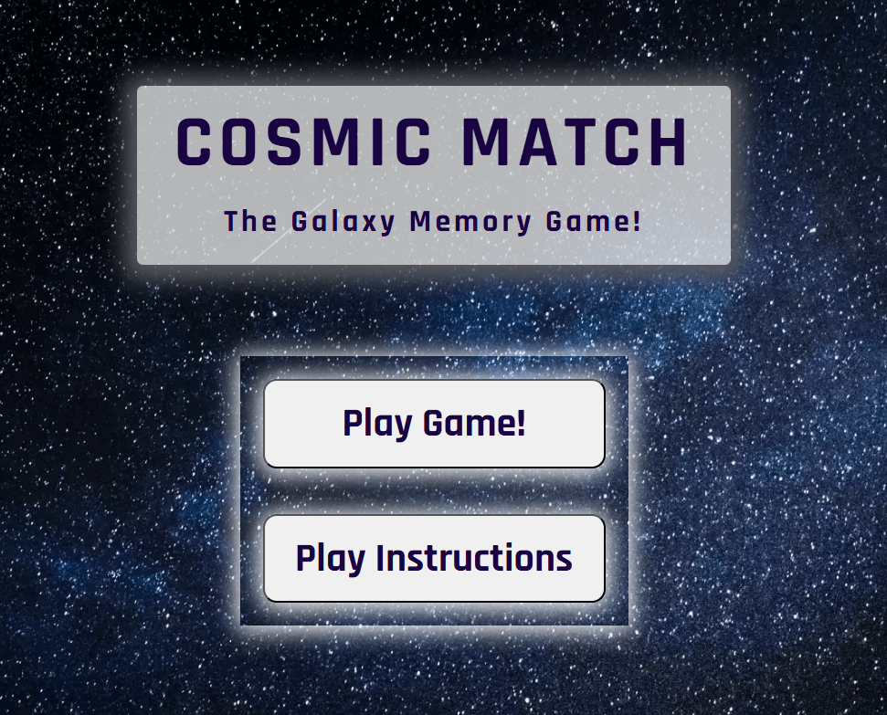
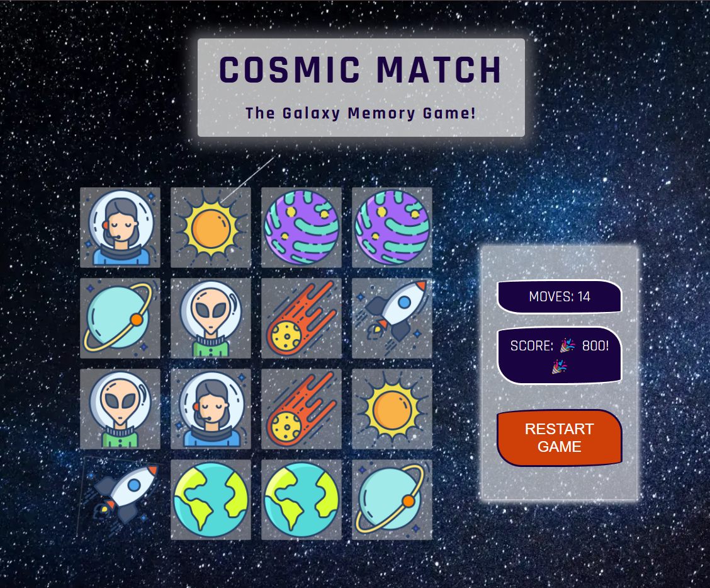
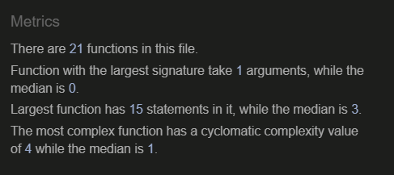
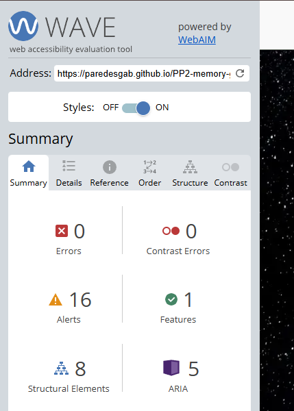
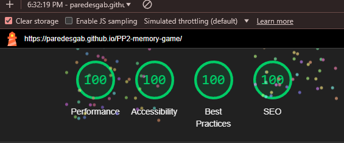

# The Cosmic Match Memory Game

(Developer: Gabriela Fabiola Paredes Rojas)

**Welcome to the Galaxy-Themed Memory Game!**

Immerse yourself in a cosmic adventure where your mission is to match 8 pairs of galaxy-inspired cards featuring celestial bodies and space explorers. Flip cards to reveal exciting images like aliens, astronauts, Earth, the Sun, and more! This untimed, stress-free game lets you play at your own pace, ensuring everyone emerges a winner. Challenge your memory through you journey through the stars.

+ The site can be accessed via this [link](https://paredesgab.github.io/PP2-memory-game/)

---
## Project Goals

### User Goals

+ Find a casual and fun activity to pass time or to relax.
+ Put memory skills to test with an enjoyable memory game. 
+ Enhance memory, concentration, and problem-solving skills.
+ Find a simple, accessible game that doesn’t require downloads or setup.
+ Find a vibrant, eye-catching game that provides a visually engaging experience.

### Site Owner Goals

  + Provide a fun, relaxed and engaging User experience.
  + Create an entertaining memory game that appeals to a broad audience.
  + Create a game that helps users improve memory, focus, and cognitive abilities. 
  + Develop a unique design and thematic experience, such as the galaxy theme, to stand out from generic memory games.
  
---
## User Experience

### Target audience

+ Space enthusiasts, kids or adults.
+ Parents looking for educational and fun games for their children.
+ Children interested in games and space and galaxy themes. 
+ Students or educators that seek tools to improve cognitive abilities.
+ Casual gamers, casual web users or individuals looking for light, engaging games to pass the time.

### User expectations

+ Accessible site.
+ Understand clearly the purpose of the site.
+ Fast and easy access to content and navigation.
+ Clean and intuitive layout, overall a smooth experience.
+ Have vibrant and eye-catching content that keeps the user engaged.
+ Expect the game to work seamlessly on various devices, allowing them to enjoy it anytime, anywhere.

### User stories

+ **As a first-time user, I want to:**

  + Quickly understand how the game works.
  + Dive into the game without confusion.
  + Have a smooth, enjoyable experience without delays or glitches.
  + Easily navigate the website and find the content interesting.
  + To be drawn into the game's theme by having an engaging and visually appealing experience.
  + Know how many movements I am doing during and a summary after the game.

+ **As a returning user, I want to:**

  + See if my cognitive skills have improved by comparing the movements I made in one game versus another.
  + See a more dynamic galaxy-themed background to make the page more immersive.
  + Check if new space card-theme designs are being featured.

+ **As the site ownser, I want:**

  + To keep the users engaged and the website updated with newer themes.
  + Deliver a smooth, accessible experience.
  + Relaxed, stress-free experience: Without a timer and the possibility of losing, players can enjoy the game at their own pace, exploring and improving their memory without feeling rushed or pressured.
  + Positive reinforcement and engagement: The "no-loss" design encourages players to keep playing and improving, offering a rewarding, fun experience where they can focus on achieving personal milestones and celebrating small victories.

---
## Features 

### Game Header

+ It contains two titles (h1 and h2) positioned at the center of the page, and they are the first elements found across all pages.
    + Clear and easy to read.
    + It uses a futuristic Google font "Rajdhanithat" and a background style that conveys and embraces the cosmic-theme.
  
+ Therefore, the user understands directly that theme of the memory game is related to galaxy, space, universe.

+ The header position and font-size are responsive across all devices. For example, it increases in size in larger screens (**Figure below**). However, it is made smaller in the page where the memory card deck is displayed. 

       
---
### Home Menu Page

+ The main page of the Galaxy Memory Game, consists of the game heading and the home menu buttons. 

+ The intention was to have a simple yet impactful background that would immediately introduce the galactic theme of the Memory Game.

+ Importantly, the same background is used across all pages. 

+ In addition, the fun universe background allows the title and buttons to stand out.

**Home Menu Buttons**

+ The home menu buttons are present on the main page of Memory Game, and they consist on two buttons: Play Game, and Play instructions. 
  
+ They are responsive, and across all devices the home menu buttons are found positioned on top of the other (flex-direction: column) (**Figure below**). 

+ The buttons will rotate slightly and change colors when hovered, creating a smooth, visually appealing interactive effect.

+ Clear and easy to read.
+ Consistent styling and easy navigation.

---
### Game Indications Page

- This section explains the user how to play and the features to expect. It also introduces the card images whose pairs need to be found. 

- This section is responsive and the images use the flex-wrap property. Top image and bottom images: mobiles and tablets (and larger devices), respectively:

---
### Memory Board Game Page

It contains two subsections, from top to bottom:

- With javascript, the class smaller-name was added to the header (i.e., game name), to make the whole page more visually organized. 

**Subsection: Game Board**

- This section presents the memory game itself: a relaxing and fun memory-matching game designed with a space-related theme.

- Players are challenged to match 8 pairs of cards, with a total of 16 cards in the game.

- The card deck array is created by Javascript within the Game Board section. 

 - The game offers a no-pressure environment where players never lose, ensuring a calm and enjoyable experience.

 - The cards will be shuffled and placed face down (**Figure below**), and they have the same hover effect as the home menu buttons. 

 
 - The memory board game page also contains a "Control Area" section displaying "Moves", "Score" and one button, the "Restart Game", placed on top of the other. 

 - The Restart Game button has the same hover effects as the home menu buttons, and to encourage the user to restart the game as much as they want, the button was made to stand out in orange. 

 - At the beginning of the game:
    - The **Moves** are set to 0, and every time the user chooses two cards, the "moves" will increase by 1.
    - The **Score** is set to 0, and every time there is a match, the player earns 100 points. When the user reaches 800 (i.e., all pairs are matched), the score will show 🎉 800! 🎉.

- The MEMORY BOARD GAME section is responsive. Namely:

  -   The card grid maintains 4 columns and 4 rows across all devices, with the width of the cards increasing on larger screens.

  - In tablets and larger screens, the memory card deck and control are placed next to each other (flex-direction: row, by default)

  - In mobiles: the Control Area is placed below the memory card deck. This was achieved because their container (id memory-game-container) was set to display property: flex, and flex-direction: column 

---
### Game Finished - Congratulations Page

- After 4s that user has matched all cards (score: 🎉 800! 🎉), the user is redirected to this page that congratulates them for their victory. 

- In addition, the congratulations message displays in bold the amount of moves the user made.

- This section contains two buttons:
  - Home Menu: Directs you back to to the Home Menu page.
  - Play again!: Starts a new game. 

- The buttons use the same style as the home menu buttons. 

- With javascript, the class smaller-name was added to the header (i.e., game name), to make the whole page more visually organized. 

---
## Features left to implement

- Implement a more dynamic galaxy-themed background (e.g., moving nebulas).

- Add a space-themed sound effect by implementing an event listener in JavaScript that triggers whenever a match occurs.

- Add animations for card flips and matches to enhance the user experience.

- Implement visual feedback (e.g., a highlight) for matched pairs.
- Allow users to navigate back to the home page directly from the memory game. Please note that for now this option was intentionally excluded to encourage players to stay on the game page longer, with the added flexibility to restart the game if they wish.

- I intentionally left out a timer to keep the game relaxed and pressure-free. However, if feedback suggests it, I’d be happy to implement it with JavaScript.

- Due to time constraints, I used onclick in all buttons of the HTML document for faster implementation. However, I recognize that mixing structure (HTML) with functionality (JS) is not best practice, as it can make the code harder to maintain and does not facilitate collaboration in team environments. After the project is graded, I plan to refactor the code by removing inline onclick attributes, and instead handling events via JavaScript by adding event listeners, ensuring better separation of concerns and improving maintainability.

---
## Design

### Color scheme

- The russian violet (blue), seasalt (white) and davy's gray color where used as the main colors of the website. Their choice was inspired by the universe background image and their used keeps the website cohesive.

- The russian violet (blue) was used for the titles, button names and the paragraph within the Game indications section.

- All buttons except for the button with class btn--restart, used as box shadow the color davy's gray color. 

- To simulate colors of the universe the hover effect used two colors as gradient: Royal purple ( #7943af) and Sapphire ( #3455af). 

- The button with the class btn--restart and the congratulatory message are styled in Sinopia orange to ensure that they stand out. This vibrant choice draws attention to the restart option, making it easy for users to replay the game, and highlights the victory message effectively, celebrating the user's success in a visually striking way.

### Typography

- "Rajdhani" and "Roboto" from Google Fonts were used as the primary and secondary font of the website, respectively. 
- The generic family name is "Sans-serif".
- For the titles (h1 and h2) letter-spacing CSS property with a value of 0.3rem was used, to add a slight space between letters in the text.

---
## Wireframes

#### Mobile

- [Mobile: Home menu page](documentation/wireframes/main-page-mobile.png)
- [Mobile: Games indications page](documentation/wireframes/game-instructions-mobile.png)
- [Mobile: Memory board game page](documentation/wireframes/memory-board-game-mobile.png)
- [Mobile: Congratulations page](documentation/wireframes/congratulations-mobile.png)

#### Tablets

- [Tablet: Home menu page](documentation/wireframes/main-page-tablet.png)
- [Tablet: Games indications page](documentation/wireframes/game-instructions-tablet.png)
- [Tablet: Memory board game page](documentation/wireframes/memory-board-game-tablet.png)
- [Tablet: Congratulations page](documentation/wireframes/congratulations-tablet.png)

#### Laptops/Desktop

- [Laptops: Home menu page](documentation/wireframes/main-page-laptops-up.png)
- [Laptops: Games indications page](documentation/wireframes/game-instructions-laptops-up.png)
- [Laptops: Memory board game page](documentation/wireframes/memory-board-game-laptops-up.png)
- [Laptops: Congratulations page](documentation/wireframes/congratulations-laptops-up.png)

---
## Technologies used
- [HTML](https://developer.mozilla.org/en-US/docs/Web/HTML)
- [CSS](https://developer.mozilla.org/en-US/docs/Web/CSS)
- [JavaScript](https://developer.mozilla.org/en-US/docs/Web/JavaScript)
- [Gitpod](https://www.gitpod.io/): the development environment to create the project files, folders and html, css and javascript codes.
- [GitHub](https://github.com/): to store the repository, bug track and see the deployed version.
- [Balsamiq](https://balsamiq.com/): to create the wireframes.
- [Google Fonts](https://fonts.google.com/): to import the Rajdhani and Roboto family fonts.
- [TinyPNG](https://tinypng.com/): to compress the images.
- [Favicon.io](https://favicon.io/): to generate the favicon images.
- [Am I responsive?](https://ui.dev/amiresponsive): to generate the responsive mockup image.
- [MDN Web Docs](https://developer.mozilla.org/en-US/): resource to check CSS properties and javascript syntax and definition descriptions.
- [Color-hex](https://www.color-hex.com/): to get the rgb color information.
- [Chrome DevTools](https://developer.chrome.com/docs/devtools?hl=de) and its open source [Lighthouse](https://developer.chrome.com/docs/lighthouse?hl=de).
-  [W3C HTML](https://validator.w3.org/) and [W3C CSS](https://jigsaw.w3.org/css-validator/) Validation Services. 
- [JSHint](https://jshint.com/): to detect errors and potential problems in the JavaScript code.
- [WAVE](https://wave.webaim.org/): to test accessibility.
- [DeepL Write](https://www.deepl.com/en/write): to spot spelling mistakes in the text. 

---
## Testing

### Validation
- In this section, the HTML and CSS codes were checked for compliance with industry standards. This was done using the W3C Markup Validation Service for HTML and CSS respectively, using the code from both: the working environment and the the deployed version.

- The result in both reports: no errors were returned.

#### HTML Validation

#### CSS Validator

#### JSHint

+ There were no errors found in the javascript using the JS Hint Validator. 
+ There was one warning, and the messaged of unused variables. This is documented in the "Bugs" section below.

### Accessibility 

Accessibility was tested using the Web Accessibility Evaluation Tool (WAVE report below), and no errors were reported. 

### LightHouse report

Lighthouse tool from Devtools was used to confirm that the website is performing well, is accessible and the colors and fonts chosen are readable.

### Device testing

- The website was checked across devices using the chrome extension [Responsive Viewer](https://chromewebstore.google.com/detail/responsive-viewer/inmopeiepgfljkpkidclfgbgbmfcennb?hl=en). 

- In addition, it was manually checked in the following devices:
  - Huawei Y9 Prime 2019
  - Iphone XR
  - Iphone 15 pro
  - Samsung Galaxy S8

### Manual Testing

| Feature | Action | Expected result | Tested | Passed | Observations |
| --- | --- | --- | --- | --- | --- |
| **Home Menu Page** | | | | | |
| Logo | Click on the "Laxus & Thiosymbion" logo | No matter the page the user is, they are redirected to the main page | Yes | Yes | - |
| Burger icon | Display of Burger icon | It appears in mobiles and up to a screen width of 767 px | Yes | Yes | - |
| Burger icon | Click on the Burger icon | It opens the navigation links in the center next to the laxus image bullet points | Yes | Yes | - |
| Navbar | Navigation display | Remains fixed at the top of all pages | Yes | Yes | 
| Navbar link: HOME | Hover and/or click on the "HOME" link | The link is highlighted, the user is redirected to the home page and the link is underlined indicating where the user is | Yes | Yes | 
| Navbar link: LAXUS | Hover and/or click on the "LAXUS" link | The link is highlighted, the user is redirected to the Laxus page and the link is underlined indicating where the user is | Yes | Yes | 
| Navbar link: THIOSYMBION | Hover and/or click on the "Thiosymbion" link | The link is highlighted, the user is redirected to the thiosymbion page and the link is underlined indicating where the user is | Yes | Yes | 
| Navbar link: NEWSLETTER | Hover and/or click on the "NEWSLETTER" link | The link is highlighted, the user is redirected to the newsletter page and the link is underlined indicating where the user is | Yes | Yes | 
| **Game Indications Page** | | | | | |
| Hero section | Image and title display | The image loads correctly and title is positioned next to it | Yes | Yes | - |
| Love story section | Title, text and video display | The title stands out, the content is justified with no spelling mistakes and the no-sound video loads correctly and it does not autoplay  | Yes | Yes | - |
| Extraordinary section | Title and images display | The title stands out, the images are loading correctly and are located near to their corresponding text, the text in the columns have no spelling mistakes and have the same style. The article links open in a new window | Yes | Yes | - |
| **LMemory Board Game Page** | | | | | |
| Hero Laxus section | Title and image display | The image is loaded correctly and the title is positioned on the left side of the screen | Yes | Yes | - |
| Laxus introduction section | Title and image display | The title stands out, all content is centered and displayed as a column (one on top each other), the text is justified with no spelling mistakes and the image loads correctly with good resolution| Yes | Yes | - |
| What Laxus gives to Thiosymbion section | Title text and image display | The title stands out, all content is displayed as a column (one on top each other), the text is justified with no spelling mistakes, and the image loads correctly with good resolution. The article link opens in a new page correctly | Yes | Yes | - |
| **Game Finished - Congratulations Page** | | | | | |
| Hero thiosymbion section | Title and image display | The image is loaded correctly and the title is positioned on the left side of the screen | Yes | Yes | - |
| Thiosymbion introduction section | Title and image display | The title stands out, all content is centered and displayed as a column (one on top each other), the text is justified with no spelling mistakes and the image loads correctly with good resolution. The article link opens in a new page correctly | Yes | Yes | - |
| What Thiosymbion gives to Laxus section | Title text and image display | The title stands, all content is displayed as a column (one on top each other), the text is justified with no spelling mistakes, and the image loads correctly with good resolution. The article link opens in a new page correctly | Yes | Yes | - |

---
## Browser compatibility

The website was tested on the following browsers:
- Google Chrome
- Firefox
- Microsof Edge

---
## Bugs
+ ### Solved bugs
  1. The nav element was initially written as "navigation". 
        - Solution: this mistake was spotted and corrected. 

  2. The flex:1 0 auto was used to not shrink the main content, and push the footer down. However, this did not work.
        - Solution: A Devtools warning message showed that the CSS body selector had the declaration written incorrectly. Namely it was as flex:display instead of display:flex. This was corrected accordingly.

  3. At some point when testing responsiveness, the header width was larger than the main section width. As a result, the use of the responsive dimensions of devtools was not possible. 
        - Solution: A red background color was used to check where the error might be coming from, and it was due to the size of one picture. Given that the header had a CSS width property of 100%, it was a adjusting to the width of this picture. This was resolved by resizing the picture. 

  4. WAVE showed the below error in the navigation bar. 
        - Solution: The error was googled and it happened because wave is likely not recognizing the i tag of the Font Awesome link. This was solved by adding a span element.
      

  5. HTML validator showed that the meta keywords were missing for the newsletter page. 
        - Solution: This was added accordingly. 

  6. In the successful page, the "Return to home page" was initially a button element placed as descendant of an anchor element. HTML validator showed this error. 
        - Solution: This was corrected by removing the button element, and using only the anchor element. 
    

+ ### Unfixed bugs

  -  The successful.html file has a different indentation than the other html files. Namely, 1 tab is 8 spaces instead of 4. This "error" was googled, consulted with the mentor, and the indent-rainbow extension was installed but this issue persisted. The file could be deleted and a new one created, but it was decided to report this as an unfixed bug so that it could be discussed. 
  

---
## Deployment

The website has been deployed to GitHub pages following these steps:

1. In the GitHub repository for the Laxus & Thiosymbion page [GitHub repository](https://paredesgab.github.io/PP2-memory-game/), select the "Settings" tab.

2. Click on "Pages" from the field "Code and automation" (on the left), and select the below settings:
    - Source: deploy from a branch.
    - Branch: main.
    - click "Save".

3. Select the "Code" tab and refresh the page. 

4. On the right side of the page, a "Deployments" section has been activated indicating a successful deployment. 

5. The live link can be accessed [here](https://paredesgab.github.io/PP2-memory-game/).

---
## Credits 

### Content 

- The Code institute ci-full-template was used to create the GitHub repository of the Laxus & Thiosymbion website.

- Text was checked with DeepL Write for spelling mistakes. 

- Inspiration to add the small *Laxus* bullet points is from the YouTube channel [Six Minutes. Smarter.](https://www.youtube.com/@SixMinutesSmarter)

- Inspiration for the hover animation of the Subscription button and the Return and home page link is from the YouTube channel [Smoljames](https://www.youtube.com/@Smoljames).

- MDN Web Docs showed me different ways to use the background-position property.

- Stack Overflow solutions was also used to resolve doubts.

- ReadMe was inspired and guided by the ReadMe documents of my mentor Iuliia Konovalova, of my cohort Kamil Wojciechowski, and of the love running project. 

### Media
  

## Acknowledgments

- My sincere gratitude to my mentor, Iuliia Konovalova, for her valuable feedback.  

- Thank you to Code Institute, specially to Kamil, Lane, Ioan and Darcy, and to the slack community members for the great tips and feedback.

- Thank you to my brother Brando, who recognized my love for coding long before I did. Your beautiful piano music [Brando PR](https://www.youtube.com/@BrandoPR) accompanied me along this project as well.